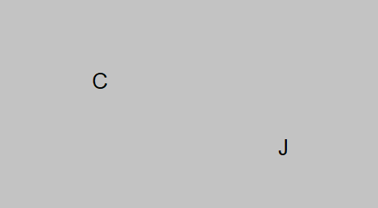

# Chapter 1.2: The Atom

Debating what exactly it means to have a cat is not in the scope of this book, but compacting such statements into equivalent
representations certainly is.

An *atom* here is an indivisible component of some statement that may be true or may be false. For example, I may say that

I have a cat \\(  = C \\)

This cat's name is Jerry \\(  = J \\)

And change our Sheet of Assertion accordingly. This is allowed because we may replace C with "I have a cat" and we may
replace J with "This cat's name is Jerry" at any time. They are equal!

So are these sheets! While they look different, they really do mean the same thing. So long as one clearly states what their
atoms mean elsewhere, they may be represented as any symbol[^1], from any alphabet, or some very long 
annoying string, if one so desires.

**Why does this matter?**

While the examples about Jerry are purposefully silly, the important part about them is that atoms can be either true
or false. Jerry may be a dog, or a cat I call Jerry
may not really be named Jerry. It is best to refer to the first sentence 
in Chapter 1. We are concerned with *how* statements are determined as true or false, less so if they *are* true
or false. 

If you find yourself a bit confused, think about something as simple as addition. Adding two numbers and receiving their sum
has worked for all numbers in your head. \\( 1 + 1 = 2 \\) is never going to suddenly turn into \\(1 + 1 = 43 \\) if you look
at the equation the wrong way. There are rules that are repeatable regardless of who is using the rule, when, how and why. 
We can plug numbers into \\( number + number = sum \\) for the rest of time and catalogue their sums if we choose. 
Every sum received will be equal to \\( number + number \\). The point is that we are concerned
with forming rules that work for certain parameters, and less so with applying them.

We say that the statement (C and J), as in, (I have a cat and This cat's name is Jerry), 
is true only if both C and J are true, and false otherwise. If C is false, or J is false, or both C and J are false,
(I have a cat and This cat's name is Jerry) no longer tells the full truth, and so therefore is considered false. 

Note that that "or" is similar to the word "and" in the structure of a sentence, as in it is a grammar conjunction,
but that we cannot represent that with just The Sheet of Assertion and atoms. It still appears useful, however.
Chapter 1.3 details how we can get this, and surprisingly construct every statement you can think of, by introducing and 
discussing The Cut.

[^1] PMH supports only single-letter, English-alphabet atoms as of version 1.0.0, but in the AEG System, generally, 
any one atom may be represented by any symbol(s).
