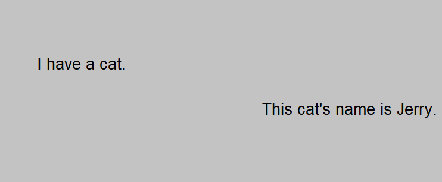

# Chapter 1.1: The Sheet of Assertion

For the truth or falsity of statements to be evaluated, one must have some way of asserting the truth or falsity of its 
components.

As an example, consider the sentence "I have a cat, and this cat's name is Jerry."
While stating that he is a cat may be true,
and while stating that he is named Jerry may be true, the overall truth or falsity of both statements together
cannot be discussed if we had no structure to convey the statements in.
The structure here is the sentence. It is a recognizable form we insert information into, because
having an audience understand what they read is important.

**Put bluntly, we need a place to put smaller stuff to make up bigger stuff**. 

Put less bluntly, we need a place in which statements can be asserted as true and evaluated together with other 
statements. From there, we can then proceed to determine if any incorrectness in a larger statement exists. 

Since the EG System was developed during a time when a computer was an occupation and not a machine, Peirce's chosen form
was a blank piece of paper. This form can be expanded to include any writable surface that maintains the information written.
This includes whiteboards, blackboards and computer screens.
Statements written on this surface are asserted as true, and if two separate statements are made,
they are considered to be in *conjunction* with each other[^1]. To discuss this Jerry character further, the above statements
would look like this on *The Sheet of Assertion*, our writable surface.

As a result of the statements being considered *conjuncts*, as in they are in conjunction with each other,
the *and* was removed. Otherwise, the sentence 
"I have a cat, and this cat's name is Jerry," and the above Sheet of Assertion are equivalent in meaning. 

Alone, this is not too powerful[^2]. 
If, once, you were in a hurry and forgot a conjunction or two in writing something down, it could
be said that you developed your own Sheet of Assertion. 

**Why does this matter?**

If we had some compact way of representing statements on the sheet, we would be able to store and evaluate the whole truth
of some large collection of statements at once. Chapter 1.2 details this compact representation in discussing The Atom.

[^1] An interesting consequence of this is that these statements do not have to be in any particular spatial relationship
aside from being on the same sheet at the same time. 
No statement must necessarily be visible to the eye, evidenced in PMH's Draw and Proof Modes. 
No statement must necessarily be next to a related statement in position, either. If some Sheet of Assertion was a thousand
miles long, a statement written at mile 0 is still in conjunction with a statement written at mile 1,000.

[^2] Of note now, but not worth detailing yet, is that other logics use the symbol ∧ to denote conjunctions
(not uppercase lambda!) This is
one example of several in the EG System where the set of symbols was cut down. This assists in an otherwise complex 
process of understanding what one is even looking at in all logics.
